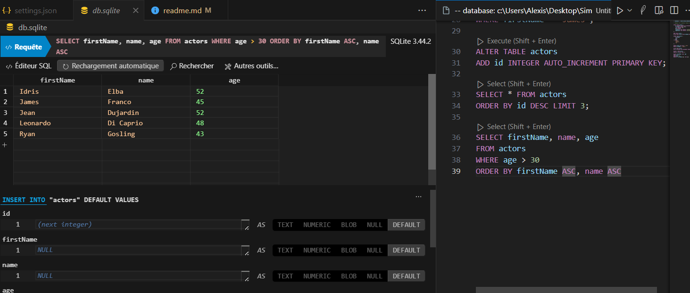

# Site de streaming
--
En tant que développeur passionné par le cinéma, vous avez toujours été fasciné par la magie du grand écran. Cette passion ne se limite pas seulement à regarder des films. Vous avez toujours été curieux de connaître les coulisses, d'étudier qui a joué dans tel film, qui l'a réalisé, et comment ces chefs-d'œuvre ont été créés. Vous trouvez aussi que les plateformes de streaming sont un formidable accès à un catalogue d'oeuvres de toute sorte à découvrir.

Afin de mener à bien ce projet, il vous faudra installer SQLite (Techno que j'ai choisi pour le réaliser).
J'utilise l'extension SQLite Viewer 3 sur Visual Studio Code.

Cela permet de voir d'avoir directement sous les yeux les tables de données et de pouvoir les modifier soit de façon simplifié comme à gauche de la capture d'écran, soit en écrivant manuellement les commandes SQL comme sur la droite de cette capture d'écran :

# Requête permettant de générer la bdd
<ul>
<li>

CREATE TABLE Users (
    user_id INT PRIMARY KEY,
    email VARCHAR (255),
    password VARCHAR (255)
);

CREATE TABLE Movies (
    movie_id INT PRIMARY KEY,
    title VARCHAR(255),
    director_id INT,
    duree INT,
    annee_sortie INT,
    FOREIGN KEY (director_id) REFERENCES Directors(director_id)
);

CREATE TABLE Users_Movies (
    user_id INT,
    movie_id INT,
    FOREIGN KEY (user_id) REFERENCES Users(User_id),
    FOREIGN KEY (movie_id) REFERENCES Movies(Movie_id),
    PRIMARY KEY (user_id, movie_id)
);

CREATE TABLE Actors (
    actor_id INT PRIMARY KEY,
    nom VARCHAR(255),
    prenom VARCHAR(255),
    role VARCHAR(255),
    date_naissance DATE
);

CREATE TABLE Acteurs_Films (
    actor_id INT,
    movie_id INT,
    FOREIGN KEY (actor_id) REFERENCES Actors(actor_id),
    FOREIGN KEY (movie_id) REFERENCES Movies(movie_id),
    PRIMARY KEY (actor_id, movie_id)
);
--

# Ajouter un acteur :

INSERT INTO actors (
    firstName,
    name,
    age
) VALUES (
    'Ryan',
    'Gosling',
    '43'
);

--

# Modifier un acteur :

UPDATE actors SET name = 'Test'
WHERE firstName = 'James';

--

# Supprimer un acteur :

DELETE FROM actors
WHERE ID = Numéro de l'ID
(ou WHERE ID IS NULL)

--

# Afficher les 3 derniers acteurs ajoutés :

SELECT * FROM actors
ORDER BY id DESC LIMIT 3

--

# Afficher les noms, prénoms et âges des cateurs/actrices de plus de 30 ans dans l'ordre aphabétiques (prénom d'abord, puis nom) :

SELECT firstName, name, age
FROM actors
WHERE age > 30
ORDER BY firstName ASC, name ASC

--

# Modifier un film :

UPDATE Movies
SET title = 'The Artist', annee_sortie = 2011
WHERE movie_id = 1

--

# Afficher les directeurs ayant le plus de films favoris :

SELECT d.name, COUNT(um.movie_id) AS total_favorite_movies
FROM Users_Movies AS um
JOIN Movies AS m ON um.movie_id = m.movie_id
JOIN Directors AS d ON m.director_id = d.director_id
GROUP BY d.name
ORDER BY total_favorite_movies DESC;

--
</li>
</ul>