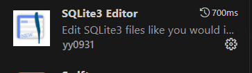

# Site de streaming
--
En tant que développeur passionné par le cinéma, vous avez toujours été fasciné par la magie du grand écran. Cette passion ne se limite pas seulement à regarder des films. Vous avez toujours été curieux de connaître les coulisses, d'étudier qui a joué dans tel film, qui l'a réalisé, et comment ces chefs-d'œuvre ont été créés. Vous trouvez aussi que les plateformes de streaming sont un formidable accès à un catalogue d'oeuvres de toute sorte à découvrir.

Afin de mener à bien ce projet, il vous faudra installer SQLite (Techno que j'ai choisi pour le réaliser).
J'utilise l'extension SQLite Viewer 3 sur Visual Studio Code.

Cela permet de voir d'avoir directement sous les yeux les tables de données et de pouvoir les modifier soit de façon simplifié comme à gauche de la capture d'écran, soit en écrivant manuellement les commandes SQL comme sur la droite de cette capture d'écran :

# Requête permettant de générer la bdd
<ul>
<li>

# Générer les tables: 

CREATE TABLE actors (
    id INTEGER PRIMARY KEY AUTOINCREMENT,
    firstName VARCHAR (50),
    name VARCHAR (50),
    birthDate DATE,
    created_at TEXT DEFAULT (strftime('%d-%m-%Y')),
    updated_at TEXT DEFAULT (strftime('%H:%M:%S'))
);

CREATE TABLE director (
    firstName VARCHAR (20),
    name VARCHAR (20),
    created_at DATETIME,
    updated_at DATETIME,
);

--

# Ajouter un acteur :

INSERT INTO actors (
    firstName,
    name,
    age
) VALUES (
    'Ryan',
    'Gosling',
    '43'
);

--

# Modifier un acteur :

UPDATE actors SET name = 'Test'
WHERE firstName = 'James';

--

# Supprimer un acteur :

DELETE FROM actors
WHERE ID = Numéro de l'ID

--

# Afficher les 3 derniers acteurs ajoutés :

SELECT * FROM actors
ORDER BY id DESC LIMIT 3

--

# Afficher les noms, prénoms et âges des cateurs/actrices de plus de 30 ans dans l'ordre aphabétiques (prénom d'abord, puis nom) :

SELECT firstName, name, age
FROM actors
WHERE age > 30
ORDER BY firstName ASC, name ASC

--

#
</li>
</ul>